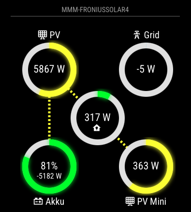
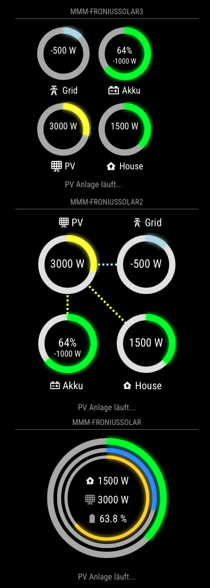

# MMM-FroniusSolar4

Module #4 of the `MMM-FroniusSolar`-family (see below)

The `MMM-FroniusSolar4` module is designed for the [MagicMirror²](https://magicmirror.builders/) platform to visualize solar energy data from a Fronius solar system and additional Shelly devices. It provides real-time visualization of energy flows and intuitive gauges for a comprehensive overview.

## Features
- **Dynamic Gauges**: Displays real-time data for:
  - `P_Akku` (Battery Power)
  - `P_Grid` (Grid Power)
  - `P_Load` (House Load)
  - `P_PV` (Solar Panel Power)
  - `P_Shelly` (Shelly PV Power)
- **Shelly Integration**: Fetches and visualizes power data from Shelly devices (See [MMM-ShellyPV](https://github.com/ChrisF1976/MMM-ShellyPV) for API instructions).
- **Text Messages**: Provides contextual messages based on power grid usage.
- **Configurable Layout**: Allows customization of radius, max power, and other gauge properties.

## Screenshot



---

## Installation
1. Clone the repository into your MagicMirror/modules directory:
   
```bash
   cd ~/MagicMirror/modules
   git clone https://github.com/ChrisF1976/MMM-FroniusSolar4.git
```
   
2. Install dependencies:
```bash
cd MMM-FroniusSolar4
npm install
```


## Configuration
Add the module to the `config.js` file:

```bash
{
    module: "MMM-FroniusSolar4",
    position: "bottom_right",
    header: "MMM-FroniusSolar4",
    config: {
        updateInterval: 5*1000, // Update Fronius Data every 5 seconds
        updateIntervalShelly: 30*1000, // Update Shelly Date every 30 seconds - keep a little higher to reduce API calls
        shellysPV: [
            { name: "PV Mini1", id: "xxxxxx" },
			{ name: "PV Mini2", id: "xxxxxx" },
			// Add more devices if necessary
		   ],
        icons: {
            P_Akku: "mdi:car-battery",
            P_Grid: "mdi:transmission-tower",
            P_Load: "mdi:home-lightbulb",
            P_PV: "mdi:solar-panel-large"
            P_Shelly: "mdi:solar-panel-large",
        },
        Radius: 120, // Radius for the SVG gauge
        MaxPower: 4000, // Maximum power for Grid scaling
        MaxPowerPV: 10400, // Maximum power for PV scaling
        MaxPowerShelly: 600, // Maximum power for shelly PV scaling
        ShowText: true,
        TextMessge: [
            { about: "600", Text: "Leicht erhöhter Netzbezug.", color: "#999" },
            { about: "1000", Text: "Über 1 KW Netzbezug!", color: "#ffffff" },
            { about: "1500", Text: "Über 1,5KW Netzbezug.", color: "#eea205" },
            { about: "2500", Text: "Über 2,5KW aus dem Netz!", color: "#ec7c25" },
            { about: "5000", Text: "Auto lädt, richtig? Nächstes Mal auf Sonne warten.", color: "#cc0605" },
            { less: "-500", Text: "Sonne scheint! Mehr als 500W frei.", color: "#f8f32b" },
            { less: "-2000", Text: "Wäsche waschen! Über 2KW freie Energie!", color: "#00bb2d" },
            { less: "-4000", Text: "Auto laden! Über 4KW freie Energie!", color: "#f80000" },
        ],
    },
},
```

### Configuration Options

| **Option**              | **Default**                           | **Description**                                                                   |
|-------------------------|---------------------------------------|-----------------------------------------------------------------------------------|
| `InverterIP`            | `"192.168.178.134"`                   | IP address of the Fronius inverter to fetch solar energy data.                    |
| `serverUriShelly`       | `"https://shelly-55-eu.shelly.cloud"` | URI for Shelly Cloud API to fetch additional PV system data. See [MMM-ShellyPV](https://github.com/ChrisF1976/MMM-ShellyPV) for instructions|
| `authKey`               | `"<your-shelly-auth-key>"`            | Authentication key for accessing the Shelly API.                                |
| `updateInterval`        | `5*1000` (5 sec)                      | Time interval (in milliseconds) between data updates from the Fronius system.     |
| `updateIntervalShelly`  | `30*1000` (30 sec)                    | Time interval (in milliseconds) between data updates from Shelly devices.         |
| `shellysPV`             | `[]`                                  | Array of Shelly devices with `name` and `id` for monitoring additional PV systems.|
| `icons`                 | N/A                                   | Define custom icons for power flow elements using [Iconify](https://iconify.design).|
| `Radius`                | `80`                                  | Radius of the SVG gauges (in pixels).                                             |
| `MaxPower`              | `1000`                                | Maximum power value for scaling `P_Grid` and `P_Load` gauges.                     |
| `MaxPowerPV`            | `10400`                               | Maximum power value for scaling `P_PV` (solar panel power).                       |
| `MaxPowerShelly`        | `600`                                 | Maximum power value for scaling `P_Shelly` (Shelly PV power).                     |
| `ShowText`              | `true`                                | Enable or disable dynamic text messages below the gauges.                         |
| `TextMessge`            | `[]`                                  | Array of objects defining conditional text messages based on `P_Grid` values.     |

#### Text Message Format

| **Key**   | **Description**                                                     |
|-----------|---------------------------------------------------------------------|
| `about`   | Display the message when `P_Grid` exceeds this value.               |
| `less`    | Display the message when `P_Grid` is below this value.              |
| `Text`    | The message to display.                                             |
| `color`   | Color of the message text (hex or CSS color names).                 |


## How It Works

### Data Retrieval
- Fetches real-time data from the Fronius system and Shelly API using the `node_helper.js` backend.

### Visualization
- Gauges are created using SVG, displaying current values and percentages.

### Dynamic Messages
- Displays context-sensitive messages based on `P_Grid` values.

## Styling

Custom styles can be adjusted in the `MMM-FroniusSolar4.css` file.

### House Gauge Color Logic

| **Condition**                        | **Color**    | **Description**                                                                                         |
|--------------------------------------|--------------|---------------------------------------------------------------------------------------------------------|
| `P_Akku - 100 > abs(P_Grid)`         | `#a3c49f`    | **Light green**: High battery activity is contributing significantly to the house's energy consumption. |
| `P_Grid > 150`                       | `#808080`    | **Gray**: High grid consumption is being used to power the house.                                       |
| `outerPower > 0`                     | `#00ff00`    | **Green**: Positive power flow (house is self-sufficient or partially consuming generated energy).      |
| `outerPower < 0`                     | `#add8e6`    | **Light blue**: Energy is being exported to the grid (surplus power).                                   |


## Dependencies

- [MagicMirror²](https://magicmirror.builders/)
- Fronius Symo GEN24 with activated SolarApi.
- Shelly device for PV power measuring

---

## Common Features of MMM-FroniusSolar(X)

All 4 modules, [MMM-FroniusSolar](https://github.com/ChrisF1976/MMM-FroniusSolar), [MMM-FroniusSolar2](https://github.com/ChrisF1976/MMM-FroniusSolar2), [MMM-FroniusSolar3](https://github.com/ChrisF1976/MMM-FroniusSolar3) and [MMM-FroniusSolar4](https://github.com/ChrisF1976/MMM-FroniusSolar3) are designed to display solar energy data. They share several configurations and CSS properties:

- **Configuration Settings**: Each module displays metrics such as `P_Akku`, `P_Grid`, `P_Load`, and `P_PV` using configurable icons and messages.
- **Dynamic SVG Gauges**: All modules include gauges to represent power flow visually.
- **Text Messages**: Each module uses conditional text messages based on `P_Grid` values.




## Key Differences

- **[MMM-FroniusSolar](https://github.com/ChrisF1976/MMM-FroniusSolar)**: Best for simple setups prioritizing clarity and minimalism.
- **[MMM-FroniusSolar2](https://github.com/ChrisF1976/MMM-FroniusSolar2)**: Suitable for scenarios requiring visual feedback on power flows (e.g., monitoring dynamic energy consumption).
- **[MMM-FroniusSolar3](https://github.com/ChrisF1976/MMM-FroniusSolar3)**: Ideal for larger or customizable displays where scalability and enhanced readability are critical.
- **[MMM-FroniusSolar4](https://github.com/ChrisF1976/MMM-FroniusSolar4)**: Similar to #2 but adds a Shelly support for monitoring small balcony solar systems.
- **[MMM-FroniusSolar5](https://github.com/ChrisF1976/MMM-FroniusSolar5)**: Similar to #2 but monitors and visualize solar energy data from multiple Fronius inverters simultaneously

---

## License

This module is distributed under the [MIT License](LICENSE). See LICENSE for more details.
